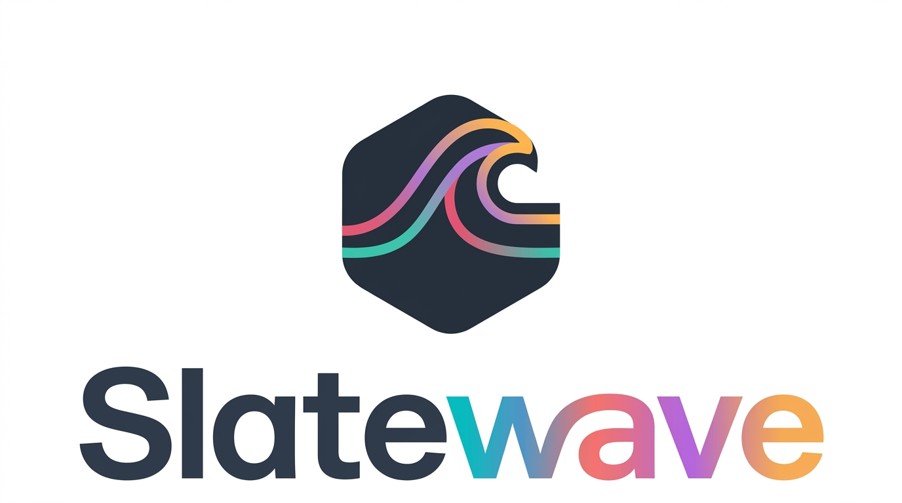

<div align="center">



# Slatewave (oh-my-posh)

A two-line oh-my-posh prompt on a warm-gray foundation with a teal signature. Designed as a twin to the [Slatewave VSCode theme](https://github.com/kevinlangleyjr/vscode-slatewave) — the prompt and editor share a single color vocabulary, so the integrated terminal and editor chrome read as one continuous surface.

> _Slate below, teal above._


</div>

---

## Layout

Two lines, three zones:

```
╭─  ~ / path    main  ≡   2    1                          3.2s  83%   CPU: 12% | RAM: 4/16GB      3:04 PM 
╰─❯$
```

- **Left**: OS → path → git → language runtimes (cmake, python, java as applicable)
- **Right**: execution time → battery → CPU / RAM → clock
- **Second line**: `╰─❯$`, teal when the last command succeeded, red when it exited non-zero

---

## Palette

### Foundation — chrome grays

Warm-neutral grays that stay readable against any segment foreground. Matches the Slatewave VSCode theme's editor/sidebar scale so prompt and editor feel continuous.

| | Hex | Used by |
|---|---|---|
|  | `#2c313a` | path, python, java, clock |
|  | `#3e4451` | OS icon, CPU / RAM |

### Signature — teal

| | Hex | Used by |
|---|---|---|
|  | `#5eead4` | path fg, python fg, java fg, clock fg, second-line prompt |
|  | `#0f766e` | cmake segment bg |
|  | `#ecfeff` | cmake fg, battery fg |

### Git states

| | Hex | Meaning |
|---|---|---|
|  | `#38bdf8` | clean branch |
|  | `#fb7185` | working / staging changes |
|  | `#B388FF` | ahead or behind upstream |
|  | `#ff4500` | diverged (both ahead **and** behind) |
|  | `#193549` | fg on light git segment |

### Battery & system

| | Hex | Meaning |
|---|---|---|
|  | `#0e7490` | battery charging / full |
|  | `#b45309` | battery discharging |
|  | `#94a3b8` | CPU / RAM text |
|  | `#cbd5e1` | execution time |

### Status

| | Hex | Meaning |
|---|---|---|
|  | `#5eead4` | last command succeeded (prompt caret) |
|  | `#ef5350` | last command exited non-zero |

---

## Segments in detail

| Segment | Shows | Foreground | Background |
|---|---|---|---|
| OS | platform icon | `#e2e8f0` | `#3e4451` |
| Path | `agnoster_short`, 2-dir max | `#5eead4` | `#2c313a` |
| Git | branch + ahead/behind + working/staging counts + stash count | `#193549` | `#38bdf8` / `#fb7185` / `#B388FF` / `#ff4500` |
| CMake | version when `CMakeLists.txt` present | `#ecfeff` | `#0f766e` |
| Python | version + virtualenv | `#5eead4` | `#3e4451` |
| Java | version | `#5eead4` | `#2c313a` |
| Execution time | `austin`-formatted duration of last command | `#cbd5e1` | _(transparent)_ |
| Battery | icon + percentage, hides at 100% on AC | `#ecfeff` | `#0e7490` charging / `#b45309` discharging |
| CPU | physical percent used | `#94a3b8` | `#3e4451` |
| RAM | used/total GB | `#94a3b8` | `#3e4451` |
| Clock | 12-hour local time | `#5eead4` | `#2c313a` |
| Exit code | prompt caret | `#5eead4` success / `#ef5350` error | _(transparent)_ |

---

## Requirements

- **oh-my-posh** ≥ v18 — [install guide](https://ohmyposh.dev/docs/installation/macos)
- A **Nerd Font** for the powerline glyphs and segment icons. Tested with MesloLGS NF and Hack Nerd Font. Configure your terminal (or VSCode's `terminal.integrated.fontFamily`) accordingly.

---

## Installation

### Clone + point your shell at it

```sh
git clone https://github.com/kevinlangleyjr/slatewave-omp.git \
  ~/.config/oh-my-posh/slatewave-omp
```

Then add to your shell init:

**zsh** (`~/.zshrc`):
```sh
eval "$(oh-my-posh init zsh --config ~/.config/oh-my-posh/slatewave-omp/slatewave.omp.yml)"
```

**bash** (`~/.bashrc`):
```sh
eval "$(oh-my-posh init bash --config ~/.config/oh-my-posh/slatewave-omp/slatewave.omp.yml)"
```

**fish** (`~/.config/fish/config.fish`):
```fish
oh-my-posh init fish --config ~/.config/oh-my-posh/slatewave-omp/slatewave.omp.yml | source
```

Reload the shell (`exec zsh`) — you should see the new prompt immediately.

### Direct download (no clone)

```sh
curl -fsSL https://raw.githubusercontent.com/kevinlangleyjr/slatewave-omp/main/slatewave.omp.yml \
  -o ~/.config/oh-my-posh/slatewave.omp.yml
```

---

## Companion VSCode theme

Slatewave ships as a matched pair:

- **[vscode-slatewave](https://github.com/kevinlangleyjr/vscode-slatewave)** — editor theme using the same palette. The integrated terminal's ANSI colors are wired to this prompt's segment colors, so the prompt renders identically inside VSCode and outside.

Color-to-role mapping across both:

| | Hex | Prompt role | VSCode role |
|---|---|---|---|
|  | `#38bdf8` | git clean | keywords, tags, info diagnostics, links |
|  | `#B388FF` | git ahead / behind | storage (`const`/`let`/`function`), decorators-adjacent |
|  | `#fb7185` | git dirty | numbers, constants, modified files, errors |
|  | `#0e7490` | battery charging | remote status bar |
|  | `#b45309` | battery discharging | warning status bar |
|  | `#ef5350` | exit ≠ 0 | editor error foreground |
|  | `#5eead4` | path / python / java / clock | primary accent (cursor, active tab, strings) |

---

## Customize

The prompt is a single YAML file — tweak segments, icons, and colors in place. Common edits:

- **Change the clock format** (12h → 24h): `time_format: "15:04"` on the time segment
- **Swap the branch glyph**: change `powerline_symbol` or `leading_diamond` on the git segment
- **Hide a segment**: delete the object, or gate it with `properties.home_enabled: false`
- **Add a segment**: append to `blocks[].segments[]` — see the [oh-my-posh segment reference](https://ohmyposh.dev/docs/segments/overview)

After editing, `exec zsh` (or open a new pane) to reload.

---

## License

MIT
