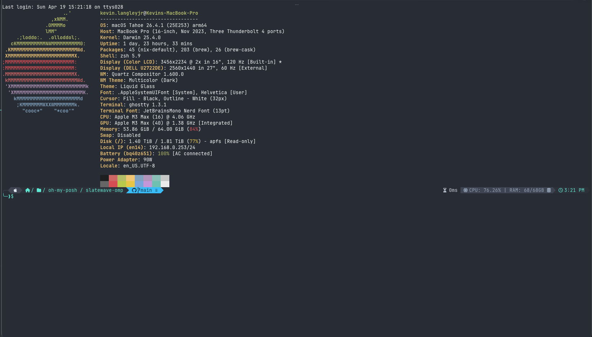

<div align="center">


<picture>
  <source media="(prefers-color-scheme: dark)" srcset="https://getslatewave.com/brand/wordmark-light.png">
  
</picture>

# Slatewave (Oh My Posh)

A two-line [Oh My Posh](https://ohmyposh.dev) prompt on a warm-gray foundation with a teal signature. Part of the [Slatewave family](#slatewave-family) — one palette across editors, terminals, prompts, notes, and more.

> _Slate below, teal above._



</div>

---

## Layout

Two lines, three zones:

```
╭─  ~ / path    main  ≡   2    1                          3.2s  83%   CPU: 12% | RAM: 4/16GB      3:04 PM
╰─❯$
```

- **Left**: OS → path → git → language runtimes (cmake, python, java as applicable)
- **Right**: execution time → battery → CPU / RAM → clock
- **Second line**: `╰─❯$`, teal when the last command succeeded, red when it exited non-zero

---

## Palette

### Foundation — chrome grays

Warm-neutral grays that stay readable against any segment foreground. Matches the Slatewave VSCode theme's editor/sidebar scale so prompt and editor feel continuous.

|                                                          | Hex       | Used by                   |
| -------------------------------------------------------- | --------- | ------------------------- |
|  | `#2c313a` | path, python, java, clock |
|  | `#3e4451` | OS icon, CPU / RAM        |

### Signature — teal

|                                                          | Hex       | Used by                                                   |
| -------------------------------------------------------- | --------- | --------------------------------------------------------- |
|  | `#5eead4` | path fg, python fg, java fg, clock fg, second-line prompt |
|  | `#0f766e` | cmake segment bg                                          |
|  | `#ecfeff` | cmake fg, battery fg                                      |

### Git states

|                                                          | Hex       | Meaning                              |
| -------------------------------------------------------- | --------- | ------------------------------------ |
|  | `#38bdf8` | clean branch                         |
|  | `#fb7185` | working / staging changes            |
|  | `#B388FF` | ahead or behind upstream             |
|  | `#ff4500` | diverged (both ahead **and** behind) |
|  | `#193549` | fg on light git segment              |

### Battery & system

|                                                          | Hex       | Meaning                 |
| -------------------------------------------------------- | --------- | ----------------------- |
|  | `#0e7490` | battery charging / full |
|  | `#b45309` | battery discharging     |
|  | `#94a3b8` | CPU / RAM text          |
|  | `#cbd5e1` | execution time          |

### Status

|                                                          | Hex       | Meaning                               |
| -------------------------------------------------------- | --------- | ------------------------------------- |
|  | `#5eead4` | last command succeeded (prompt caret) |
|  | `#ef5350` | last command exited non-zero          |

---

## Segments in detail

| Segment        | Shows                                                        | Foreground                                                                                                                                            | Background                                                                                                                                                                                                                                                                        |
| -------------- | ------------------------------------------------------------ | ----------------------------------------------------------------------------------------------------------------------------------------------------- | --------------------------------------------------------------------------------------------------------------------------------------------------------------------------------------------------------------------------------------------------------------------------------- |
| OS             | platform icon                                                | `#e2e8f0`                                                                                     | `#3e4451`                                                                                                                                                                                                                 |
| Path           | `agnoster_short`, 2-dir max                                  | `#5eead4`                                                                                     | `#2c313a`                                                                                                                                                                                                                 |
| Git            | branch + ahead/behind + working/staging counts + stash count | `#193549`                                                                                     | `#38bdf8`  / `#fb7185`  / `#B388FF`  / `#ff4500`  |
| CMake          | version when `CMakeLists.txt` present                        | `#ecfeff`                                                                                     | `#0f766e`                                                                                                                                                                                                                 |
| Python         | version + virtualenv                                         | `#5eead4`                                                                                     | `#3e4451`                                                                                                                                                                                                                 |
| Java           | version                                                      | `#5eead4`                                                                                     | `#2c313a`                                                                                                                                                                                                                 |
| Execution time | `austin`-formatted duration of last command                  | `#cbd5e1`                                                                                     | _(transparent)_                                                                                                                                                                                                                                                                   |
| Battery        | icon + percentage, hides at 100% on AC                       | `#ecfeff`                                                                                     | `#0e7490`  charging / `#b45309`  discharging                                                                                                                      |
| CPU            | physical percent used                                        | `#94a3b8`                                                                                     | `#3e4451`                                                                                                                                                                                                                 |
| RAM            | used/total GB                                                | `#94a3b8`                                                                                     | `#3e4451`                                                                                                                                                                                                                 |
| Clock          | 12-hour local time                                           | `#5eead4`                                                                                     | `#2c313a`                                                                                                                                                                                                                 |
| Exit code      | prompt caret                                                 | `#5eead4`  success / `#ef5350`  error | _(transparent)_                                                                                                                                                                                                                                                                   |

---

## Requirements

- **oh-my-posh** ≥ v18 — [install guide](https://ohmyposh.dev/docs/installation/macos)
- A **Nerd Font** for the powerline glyphs and segment icons. Tested with MesloLGS NF and Hack Nerd Font. Configure your terminal (or VSCode's `terminal.integrated.fontFamily`) accordingly.

---

## Installation

### Clone + point your shell at it

```sh
git clone https://github.com/kevinlangleyjr/slatewave-omp.git \
  ~/.config/oh-my-posh/slatewave-omp
```

Then add to your shell init:

**zsh** (`~/.zshrc`):

```sh
eval "$(oh-my-posh init zsh --config ~/.config/oh-my-posh/slatewave-omp/slatewave.omp.yml)"
```

**bash** (`~/.bashrc`):

```sh
eval "$(oh-my-posh init bash --config ~/.config/oh-my-posh/slatewave-omp/slatewave.omp.yml)"
```

**fish** (`~/.config/fish/config.fish`):

```fish
oh-my-posh init fish --config ~/.config/oh-my-posh/slatewave-omp/slatewave.omp.yml | source
```

Reload the shell (`exec zsh`) — you should see the new prompt immediately.

### Direct download (no clone)

```sh
curl -fsSL https://raw.githubusercontent.com/kevinlangleyjr/slatewave-omp/main/slatewave.omp.yml \
  -o ~/.config/oh-my-posh/slatewave.omp.yml
```

---

## Slatewave family

One palette. Every tool.

- **Editors** — [VSCode](https://github.com/kevinlangleyjr/vscode-slatewave) · [Neovim](https://github.com/kevinlangleyjr/neovim-slatewave) · [Helix](https://github.com/kevinlangleyjr/helix-slatewave) · [Zed](https://github.com/kevinlangleyjr/zed-slatewave) · [Sublime Text](https://github.com/kevinlangleyjr/sublime-text-slatewave) · [JetBrains](https://github.com/kevinlangleyjr/jetbrains-slatewave)
- **Terminals** — [Alacritty](https://github.com/kevinlangleyjr/alacritty-slatewave) · [Ghostty](https://github.com/kevinlangleyjr/ghostty-slatewave) · [iTerm2](https://github.com/kevinlangleyjr/iterm2-slatewave) · [WezTerm](https://github.com/kevinlangleyjr/wezterm-slatewave) · [Windows Terminal](https://github.com/kevinlangleyjr/windows-terminal-slatewave)
- **Prompt** — [Starship](https://github.com/kevinlangleyjr/starship-slatewave)
- **Multiplexer** — [tmux](https://github.com/kevinlangleyjr/tmux-slatewave)
- **Notes** — [Obsidian](https://github.com/kevinlangleyjr/obsidian-slatewave) · [Logseq](https://github.com/kevinlangleyjr/logseq-slatewave)
- **Launchers** — [Alfred](https://github.com/kevinlangleyjr/alfred-slatewave) · [Raycast](https://github.com/kevinlangleyjr/raycast-slatewave)
- **Chat** — [Slack](https://github.com/kevinlangleyjr/slack-slatewave)

See [getslatewave.com](https://getslatewave.com) for the full family.

---

## Customize

The prompt is a single YAML file — tweak segments, icons, and colors in place. Common edits:

- **Change the clock format** (12h → 24h): `time_format: "15:04"` on the time segment
- **Swap the branch glyph**: change `powerline_symbol` or `leading_diamond` on the git segment
- **Hide a segment**: delete the object, or gate it with `properties.home_enabled: false`
- **Add a segment**: append to `blocks[].segments[]` — see the [oh-my-posh segment reference](https://ohmyposh.dev/docs/segments/overview)

After editing, `exec zsh` (or open a new pane) to reload.

---

## License

[WTFPL](LICENSE) — Do What The Fuck You Want To Public License, Version 2.
